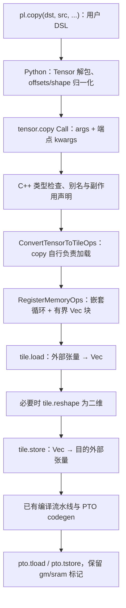

# PyPTO copy 与 create_tensor：设计、源码导航和实现详解

> 后续接口更新：`pl.copy(dst, src)` 已改为 `dst = src` 加 L2 prefetch/wait 的前端封装。
> 本文下面的分块 load/store 方案保留为历史实现，对应 `pl.tensor.copy` 底层搬运接口。
> 新接口详情见 [算子文档](../zh/dev/ir/05-operators.md)，不再具有目的缓冲区写入语义。

基于提交：`07c9c0bf`（分支 `feat/sram-transfer-protocol`）。

> 2026-09-20 接口更新：以下内容描述上述提交的旧返回值方案。当前 copy 已改为
> `pl.copy(dst, src, ...)` 独立语句，原地写入 dst，不返回 Tensor；C++ 返回 UnknownType，
> 算子不再声明 set_output_reuses_input(0)，仍保留目的参数 Write 和 DMA 写通道。
> Python 封装直接返回供解析器使用的 IR Call。内部 load/store 与循环携带 dst 的实现不变。
> 原示例中的 `a1 = pl.copy(a1, a, ...)` 应改为 `pl.copy(a1, a, ...)`。
> 当前接口以 [算子文档](../zh/dev/ir/05-operators.md) 为准。

本文说明当前已实现的行为，而非未来 SRAM 硬件方案。源码链接指向本地 `D:/code/pypto`，行号以该提交为准。文中的简化 IR 和伪代码均明确标注，不应直接作为可执行程序使用。

## 1. 先明确目前实现的是什么

`pl.copy` 是一个具有真实写入副作用的张量拷贝算子。编译器将它展开为循环中的 `tile.load` 和 `tile.store`：每次从源张量取一个小块到 Vec，再写入目的张量。当前没有新增独立的硬件 copy 指令，也没有通过 Python 或 CPU 的 memcpy 完成设备数据搬运。

`pl.create_tensor(..., memory_type=...)` 增加了 DDR/SRAM 分配意图的表达。**当前 SRAM 声明仍使用 DDR 运行时分配，尚未接入真实 SRAM 分配器。** TensorType 的全局地址空间不因这个参数而改变。

| 接口或概念 | 当前含义 | 不应误解为 |
| --- | --- | --- |
| `create_tensor(memory_type=DDR)` | 默认张量创建行为；在 orchestration 中由运行时分配 DDR 缓冲区 | copy 操作本身 |
| `create_tensor(memory_type=SRAM)` | 在 IR 中保留 SRAM 分配意图，当前以 DDR 承载 | 已分配真实 SRAM |
| `copy(source_memory=DDR, target_memory=DDR)` | 从一个 DDR 张量读出，再写入另一个 DDR 张量 | 仅修改变量名或共享输入指针 |
| copy 的 SRAM 端点 | 声明外部内存介质，并保留到生成代码 | 自动切换分配器或转换地址 |
| `Vec` | copy 使用的片上 tile 暂存空间 | 用户所说的 chip 层 SRAM |
| SoC 中的 SRAM 容量 | 模型配置中的 chip 共享内存描述 | 设备探测结果或可用 SRAM 堆 |

当前支持 DDR → DDR、DDR → SRAM、SRAM → DDR；不支持 SRAM → SRAM。为了兼容第一阶段接口，copy 默认端点仍为 DDR → SRAM。当前做 DDR 数值验证时必须显式指定 `target_memory=pl.Mem.DDR`。

## 2. 源码入口地图

### 2.1 copy 主路径

| 层次 | 源码入口 | 本次作用 |
| --- | --- | --- |
| DSL 前端 | [language/op/tensor_ops.py:233](/D:/code/pypto/python/pypto/language/op/tensor_ops.py:233) | `pl.copy` 的 Tensor 包装、参数归一化 |
| IR Python 接口 | [ir/op/tensor_ops.py:41](/D:/code/pypto/python/pypto/ir/op/tensor_ops.py:41) | 构造两参数或五参数的 `tensor.copy` Call |
| C++ 类型检查 | [tensor_ops/memory.cpp:44](/D:/code/pypto/src/ir/op/tensor_ops/memory.cpp:44) | 参数、端点、形状、dtype 检查 |
| 算子注册 | [tensor_ops/memory.cpp:76](/D:/code/pypto/src/ir/op/tensor_ops/memory.cpp:76) | 输出别名、写副作用、DMA 写通道和 VECTOR 亲和性 |
| 共用形状检查 | [comm_op_utils.h:168](/D:/code/pypto/src/ir/op/distributed/comm_op_utils.h:168) | 复用已有整张量/区域检查工具 |
| 默认加载排除 | [convert_tensor_to_tile_ops_pass.cpp:434](/D:/code/pypto/src/ir/transforms/convert_tensor_to_tile_ops_pass.cpp:434) | 防止 copy 输入提前变成 tile |
| 核心 lowering | [op_conversion_registry.cpp:526](/D:/code/pypto/src/ir/transforms/op_conversion_registry.cpp:526) | 构造分块循环、load、reshape、store |
| 流水线分类 | [backend.cpp:528](/D:/code/pypto/src/backend/common/backend.cpp:528) | copy 的逻辑 pipe 推断 |
| PTO 内存指令生成 | [pto_ops_memory.cpp:216](/D:/code/pypto/src/backend/common/pto_ops_memory.cpp:216) | 沿用已有端点属性输出，生成 `pto.tload/tstore` |
| 打印回读修复 | [python_printer.cpp:3222](/D:/code/pypto/src/ir/transforms/python_printer.cpp:3222) | 复合 shape 表达式打印时保留变量重命名上下文 |

`pto_ops_memory.cpp` 中的端点输出来自本分支前面的 SRAM load/store 改动；此次 copy lowering 复用它，不重复实现一套 PTO 指令生成器。`comm_op_utils.h` 也是复用已有实现。

### 2.2 create_tensor 与配套修改

| 层次 | 源码入口 | 本次作用 |
| --- | --- | --- |
| DSL 前端 | [language/op/tensor_ops.py:166](/D:/code/pypto/python/pypto/language/op/tensor_ops.py:166) | 新增关键字参数并透传 |
| 名字导出 | [language/op/__init__.py:66](/D:/code/pypto/python/pypto/language/op/__init__.py:66) | 已有 `create as create_tensor` 别名；copy 同时加入导出 |
| IR Python 构造 | [ir/op/tensor_ops.py:69](/D:/code/pypto/python/pypto/ir/op/tensor_ops.py:69) | 校验 memory_type，SRAM 写入 kwargs |
| C++ 类型推导 | [tensor_ops/memory.cpp:135](/D:/code/pypto/src/ir/op/tensor_ops/memory.cpp:135) | 接受 DDR/SRAM，保留原 TensorType 构造 |
| C++ 属性注册 | [tensor_ops/memory.cpp:589](/D:/code/pypto/src/ir/op/tensor_ops/memory.cpp:589) | 注册 `memory_type` 为 MemorySpace 属性 |
| InCore 转换保护 | [op_conversion_registry.cpp:894](/D:/code/pypto/src/ir/transforms/op_conversion_registry.cpp:894) | 不允许 SRAM 声明静默变为片上 tile |
| orchestration 代码生成 | [tensor_op_codegen.cpp:80](/D:/code/pypto/src/codegen/tensor_op_codegen.cpp:80) | SRAM 输出 DDR 承载说明，继续生成 TensorCreateInfo |
| 既有批量分配逻辑 | [orchestration_codegen.cpp:3245](/D:/code/pypto/src/codegen/orchestration/orchestration_codegen.cpp:3245) | 生成 alloc_tensors 和 Tensor 引用；本次未改其分配机制 |
| SoC chip 共享内存 | [soc.h:230](/D:/code/pypto/include/pypto/backend/common/soc.h:230) | 新增 SoC 级 mems 查询 |
| 模拟 SoC 配置 | [soc.cpp:159](/D:/code/pypto/src/backend/common/soc.cpp:159) | chip 层 SRAM 模型配置；950 配置在同文件后部 |
| Python 绑定 | [bindings/backend.cpp:115](/D:/code/pypto/python/bindings/modules/backend.cpp:115) | 暴露 `soc.mems`，同步 backend.pyi |

推荐阅读顺序：DSL `copy` → IR Python `copy` → C++ 检查/注册 → `RegisterMemoryOps` → PTO 内存指令生成，再阅读 create_tensor 的四层适配。

## 3. copy 的整体调用链



物理搬运路径为：

```text
src 的 DDR/SRAM 全局地址
    -- load / MTE2 --> Vec 小块
    -- store / MTE3 --> dst 的 DDR/SRAM 全局地址
```

目的存储在 copy 前就必须存在。copy 不调用 create_tensor，不分配第二份目的张量；它会申请/使用编译器管理的 Vec 暂存 tile。

## 4. copy 前端：每段代码做什么

### 4.1 API 的参数与返回值

```python
pl.copy(
    dst, src,
    dst_offsets=None, src_offsets=None, shape=None,
    *, source_memory=pl.Mem.DDR, target_memory=pl.Mem.SRAM,
)
```

| 参数 | 含义 |
| --- | --- |
| dst | 要写入的目的张量，排在第一个参数 |
| src | 提供数据的源张量 |
| dst_offsets | 在目的张量内的起始坐标，单位为元素 |
| src_offsets | 在源张量内的起始坐标，单位为元素 |
| shape | 要搬运的区域大小，单位为元素 |
| source_memory | 源外部介质 DDR/SRAM |
| target_memory | 目的外部介质 DDR/SRAM |
| 返回值 | 表示更新后的 dst，与 dst 共用目的存储 |

这里 `dst = pl.copy(dst, src, ...)` 中的赋值表达的是 IR 数据流更新，不是给 dst 换一个新分配的地址。

### 4.2 language 层包装

新增的 language `copy` 主要做三件事：

```python
dst.unwrap()
src.unwrap()
None if shape is None else _normalize_intlike(shape)
```

`unwrap()` 从 DSL 的 Tensor 对象取出底层 IR Expr。`_normalize_intlike` 把 Python 整数、DSL Scalar、IR 表达式统一成下层可接受的形式。offsets 也执行同样处理；省略的参数保持 None。

最后用 `dst.__class__(expr=...)` 包装返回的 Call，保留目的 Tensor 的包装类。这里构建的是编译期表达式，不是在执行 Python 时遍历张量元素。

### 4.3 IR Python 层为什么区分 2 个参数和 5 个参数

实现先构造 `args = [dst, src]`。如果任意一个区域参数非 None，则要求另外两个也存在，再把三个列表转为 `MakeTuple`。

```text
整张量形式：args = [dst, src]
区域形式：  args = [dst, src, dst_offsets_tuple, src_offsets_tuple, shape_tuple]
端点属性：  kwargs = {source_memory: ..., target_memory: ...}
```

这种设计使 `copy(dst, src)` 简洁，同时不需要猜测“只给 shape 时 offsets 应该取什么”。端点属性不是数据操作数，不参与 offsets/shape 的位置排列。

调用 `create_op_call("tensor.copy", ...)` 后进入注册好的 C++ 类型推导函数。`span` 用于把报错定位回用户源码。

## 5. C++ 算子检查与注册：为什么这些声明必要

### 5.1 DeduceTensorCopyType 的检查顺序

1. 参数个数只能是 2 或 5，参数表达式不能为空。
2. src/dst 必须是 tensor-like 类型；dtype 一致，rank 相同且非零。
3. 端点仅允许 DDR→DDR、DDR→SRAM、SRAM→DDR。
4. 整张量形式：每维必须匹配。静态维度按值比较，动态维度要求表达式结构相同；可静态判断的维度必须大于零。
5. 区域形式：三个区域 tuple 的长度必须匹配 rank；检查静态 shape 正数、静态 offset 非负，以及可证明的源/目的静态越界。
6. 区域 tuple 中的每个元素必须是整数标量。
7. 返回 `args[0]->GetType()`，保持目的张量类型。

这里复用了通信算子的形状检查函数，但并没有把 copy 实现成跨设备通信。对于动态 offset/extent，当前没有新增运行时边界断言，调用者仍需保证合法。

源和目的区域要求不重叠；当前实现不提供 memmove 语义，也没有新增指针重叠检测。不能因为输出别名 dst，就认为允许 src/dst 任意重叠。

### 5.2 注册链逐项解释

```cpp
.set_output_reuses_input(0)
.set_arg_effect(0, ArgEffect::Write)
.set_write_channel(WriteChannel::Dma)
.set_core_affinity(core_affinity::CoreAffinity::VECTOR)
.no_memory_spec()
.f_deduce_type(DeduceTensorCopyType)
```

| 代码 | 作用 |
| --- | --- |
| set_output_reuses_input(0) | 明确输出复用第 0 个参数 dst 的存储，供别名分析和后续转换使用 |
| set_arg_effect(0, Write) | 声明会写 dst，不能把它当纯计算表达式；src 使用默认 Read 效果 |
| set_write_channel(Dma) | 写入来自 DMA 搬运通道，供相关分析使用；不是“新建 DMA 引擎” |
| VECTOR | copy 的 Vec load/store 路径放到向量侧；不在 cube 侧重复执行 |
| no_memory_spec() | 此 tensor 算子不声明通用 tile 输入/输出位置约束，实际 Vec 位置由自定义 lowering 指定 |
| f_deduce_type(...) | 连接上面描述的类型检查与返回类型推导 |

返回 dst 类型和声明输出复用 dst 是两件事：前者说明 shape/dtype 等类型信息，后者说明存储别名关系，两者都需要。

## 6. 核心 lowering：逐段解释分块 load/store

实现位于 `OpConversionRegistry::RegisterMemoryOps()` 内新增的 `RegisterCustom("tensor.copy", ...)`。

### 6.1 保留外部 tensor 输入

转换入口再次检查两个输入是 tensor-like，报错信息为 `requires addressable tensors, not computed tile values`。

这是因为 copy 需要源/目的的外部张量地址。与此同时，`convert_tensor_to_tile_ops_pass.cpp` 把 `tensor.copy` 视为自行加载的算子，避免第一阶段自动给它插入通用 Vec load。否则可能在进入 copy 转换器前，源张量已经变成 tile，或者产生不符合 copy offsets 的冗余加载。

### 6.2 统一整张量和区域形式

```cpp
const auto shape_arg = args.size() == 5 ? args[4] : MakeShapeTuple(src_type->shape_, span);
const auto dst_arg = args.size() == 5 ? args[2] : MakeZeroOffsets(src_type->shape_.size(), span);
const auto src_arg = args.size() == 5 ? args[3] : MakeZeroOffsets(src_type->shape_.size(), span);
```

区域形式直接使用用户参数。整张量形式则使用 src 的 shape 和两组全零 offsets。前面的类型检查已经保证整张量的 src/dst 形状匹配，因此后续 lowering 只需实现一套区域遍历算法。

### 6.3 设置暂存块大小

```cpp
int64_t width = 256;
if (auto cols = As<ConstInt>(shape.back())) width = std::min(width, cols->value_);
```

只有最内维分块，其他维度每次选择一个坐标。最内维静态已知时，块宽取 `min(256, 最内维长度)`；动态时采用固定物理块宽 256。

**256 的单位是元素，不是字节。** FP32 的 256 个有效物理元素对应 1024 字节数据，最终 tile 存储仍受既有布局、对齐和内存规划规则影响。这个参数目前固定在代码里，没有作为用户调优参数暴露。

其目的在于让暂存规模不随整个 tensor 大小线性增长；当前方案以正确性为先，没有双缓冲或专门的吞吐调优。

### 6.4 positions 与递归 lower

`positions` 保存每个维度的循环索引。`lower(dim, dst)` 是一个编译期递归函数，用来构造嵌套 `ForStmt`，并非每搬一个元素就在运行时调用一次 C++ 递归函数。

- `dim < rank`：生成当前维度循环，再递归构造内层。
- `dim == rank`：所有坐标已确定，生成一次 load/store。
- 外层各维步长为 1，最内维步长为 chunk。

### 6.5 计算源/目的坐标

```cpp
src_offsets.push_back(MakeAdd(src_base[i], positions[i], span));
dst_offsets.push_back(MakeAdd(dst_base[i], positions[i], span));
```

同一个局部遍历坐标分别加上两个起点。因此可以把 `src[0:2, 16:593]` 放到 `dst[1:3, 8:585]`，源和目的不必具有相同起始坐标。

### 6.6 区分物理 shape 与 valid_shape

```cpp
std::vector<ExprPtr> physical(shape.size(), one);
physical.back() = chunk;
auto valid = physical;
valid.back() = MakeMin(chunk, MakeSub(shape.back(), positions.back(), span), span);
```

`physical` 决定 tile 的物理大小，前面各维是 1，最后一维是 chunk。`valid` 决定本次真正有效的元素范围，最内维取 `min(chunk, 剩余元素数)`。

以 `[4, 600]` 为例，每一行执行：

| 最内维起点 | 物理块宽 | 有效块宽 | 对应源元素 |
| --- | --- | --- | --- |
| 0 | 256 | 256 | 0～255 |
| 256 | 256 | 256 | 256～511 |
| 512 | 256 | 88 | 512～599 |

4 行共 12 次块搬运，每次一条逻辑 tile.load 和一条逻辑 tile.store。尾块仍有固定物理暂存大小，但有效区域只有 88；后续 load/store codegen 使用有效区域构造访问视图，不应向目的张量多写 168 个元素。

### 6.7 创建 load、必要的 reshape 和 store

以下是语义伪代码，参数名为解释用途：

```text
chunk_tile = tile.load(
    src, src_offsets, physical_shape, valid_shape,
    source_memory=source, target_memory=Vec)

if rank != 2:
    chunk_tile = tile.reshape(chunk_tile, [1, chunk])

updated_dst = tile.store(
    chunk_tile, dst_offsets, dst,
    source_memory=Vec, target_memory=target)
```

load 明确从外部端点读到 Vec；store 明确从 Vec 写到外部端点。rank 不为 2 时，将临时 tile 统一为 `[1, chunk]` 形状，便于走既有二维 tile/store 路径。外部张量的源/目的 offsets 仍然保留原 rank，不是把整个 tensor 的寻址改成一维。

这里复用 `tile.reshape` 对有效区域的传递规则，copy 没有另造一套尾块掩码机制。

### 6.8 prologue、IterArg、YieldStmt 的含义

`ConversionResult` 包含 `prologue` 和 `result`：前者是结果表达式之前必须执行的语句，后者是替换原表达式的结果。

| 局部变量/IR 节点 | 含义 |
| --- | --- |
| copy_chunk | load 产生的 Vec tile |
| copy_chunk_2d | 必要时 reshape 后的二维 tile |
| copy_dst / IterArg | 循环携带的目的张量版本，初始值为外层 dst |
| copy_updated | 内层搬运后的目的张量版本 |
| YieldStmt | 把当前迭代的目的张量版本交给下一次迭代/循环结果 |
| copy_result | 循环结束后替代原 copy 表达式的结果 |

可以把它理解为静态单赋值 IR 中的“连续更新 dst”。这些变量不表示每次循环都新分配一块 DDR，存储仍由别名关系连接到原目的张量。

简化的二维伪 IR 为：

```text
result = for row = 0 .. rows step 1, carry dst:
    row_result = for col = 0 .. cols step chunk, carry dst:
        valid_cols = min(chunk, cols - col)
        tile = load(src, src_base + [row, col], [1, chunk], [1, valid_cols])
        updated = store(tile, dst_base + [row, col], dst)
        yield updated
    yield row_result
```

## 7. pipe 推断和最终代码生成

### 7.1 为什么 copy 推断为 MTE2，内部却还有 MTE3

`InferCommonPtoPipe` 对 `tensor.copy` 增加专门分支：DDR→DDR 返回 MTE2；DDR→SRAM、SRAM→DDR 通过外部介质连接查询分别分类为 MTE2、MTE3。

**这是高层 copy 的逻辑分类，不代表整个 copy 只有一条物理指令或只使用一个 pipe。** 降低后的 load 与 store 仍分别按自己的源/目的位置推断，使用 MTE2 读入和 MTE3 写出。

DDR→DDR 没有为了分类而在 SoC 图中添加 DDR 自环。实现直接识别该路径，避免把“同一介质上的两份数据搬运”误建模为硬件新增连接。

### 7.2 端点属性如何传到 PTO

已有 `AppendExternalMemoryAttribute` 把 DDR 映射为 `"gm"`，SRAM 映射为 `"sram"`。

| copy 路径 | load 的 source_memory | store 的 target_memory |
| --- | --- | --- |
| DDR → DDR | gm | gm |
| DDR → SRAM | gm | sram |
| SRAM → DDR | sram | gm |

最终输出形如以下示意，省略了完整操作数类型：

```text
pto.tload  ... {source_memory = "gm"}
pto.tstore ... {target_memory = "gm"}
```

这些属性描述外部 tensor 的端点；暂存 tile 仍在 Vec，不会生成 `loc=sram` 的 tile。属性本身不会修改指针，不会按物理地址范围自动确认目标确实在 SRAM。

### 7.3 同步与跨 InCore 生命周期

本次没有新增 event/wait 或跨核同步协议。load/store 的指令依赖、任务读写依赖继续交给已有编译/运行框架。

跨 InCore 可复用，是因为目的张量由 orchestration 层创建，并传给多个 InCore 调用；不是因为 Vec 临时块在两个 kernel 之间保留。Vec 只服务当前 copy kernel，跨调用保存数据的是外部目的张量。

## 8. create_tensor 前端和后端的适配详解

### 8.1 名字与兼容性

`pl.create_tensor` 对应的 Python 实现函数实际上名为 `create`，通过别名导出。因此之前旧环境报错会显示 `create() got an unexpected keyword argument 'memory_type'`。

language 层签名保留原有 shape、dtype、layout、manual_dep、init_value 的顺序，新增：

```python
*, memory_type: MemorySpace = MemorySpace.DDR
```

星号表示必须按关键字传递，避免第三个位置参数原本是 layout、现在被误解释成内存类型。IR Python 层也追加关键字参数，保留它原有的 span 位置。

正确用法：

```python
buf = pl.create_tensor([64, 64], dtype=pl.FP32, memory_type=pl.Mem.DDR)
```

不是 `pl.create_tensor(shape, dtype, pl.Mem.DDR)`。

### 8.2 language 层：只增加透传

language `create` 调用 `_ir_ops.create(...)` 时新增 `memory_type=memory_type`。返回对象仍为 `Tensor(expr=call_expr)`，没有增加新的 SRAM Tensor 包装类型，也没有修改运行时调用入口。

### 8.3 IR Python 层：校验与规范化

```python
if memory_type not in (MemorySpace.DDR, MemorySpace.SRAM):
    raise ValueError(...)
if memory_type != MemorySpace.DDR:
    kwargs["memory_type"] = memory_type
```

拒绝 Vec、Mat、Acc 等 tile 内存空间。默认 DDR 不写入新属性，是为了保持旧 IR 的规范形式：默认调用和显式 DDR 调用在该前端生成结构相同的 IR；显式 SRAM 才增加 `memory_type=SRAM`。

原有 layout、manual_dep 行为保持原样。`init_value` 的“不再支持”报错是既有行为，本次没有恢复张量初始化功能。

### 8.4 C++ 层：属性注册与第二道校验

注册表增加 `.set_attr<MemorySpace>("memory_type")`。类型推导函数通过 `GetKwargOr(..., DDR)` 读取属性，并检查值只能是 DDR/SRAM。

这道检查覆盖直接构造 C++/IR Call、绕过 Python 封装的入口。Python 检查负责尽早反馈，C++ 检查保证核心 IR 合法。

后面的类型创建依旧是：

```cpp
auto tensor_type = std::make_shared<TensorType>(shape, dtype);
```

因此 SRAM 分配意图保存在创建算子的 kwargs 中，没有变成 TensorType 的新地址空间字段。不要通过 `tensor.type.memory_space` 推断它的真实介质，也不能指望 copy 自动从该属性推导端点。

### 8.5 InCore 转换保护

既有 `tensor.create` 在 InCore 转换中可降低为 `tile.create`。本次对显式 SRAM 属性增加检查，禁止走这条路径，错误提示要求在 orchestration 创建后传入 InCore。

这是为了防止用户写 `memory_type=SRAM`，最终却无提示地得到 Vec/其他片上 tile。**该保护不是一个 SRAM 分配实现。** 默认 DDR 的既有 InCore create→tile 行为仍被保留，因此 memory_type 也不是在任何作用域都强制创建外部 DDR 的通用开关。

### 8.6 orchestration 代码生成：改了什么，没改什么

`REGISTER_ORCHESTRATION_OP(tensor_create, ...)` 新增 SRAM 分支，输出：

```cpp
// memory_type=SRAM: emulated with DDR backing by the current runtime.
```

后续继续生成原来的 shape 数组与 `TensorCreateInfo`，示意如下：

```cpp
uint32_t buf_ci_shapes[2] = {64, 64};
TensorCreateInfo buf_ci(buf_ci_shapes, 2, /* dtype */ ...);
```

已有 orchestration 分配逻辑再生成：

```cpp
TaskOutputTensors alloc_0 = alloc_tensors(buf_ci);
const Tensor& buf = alloc_0.get_ref(0);
```

本次没有给 TensorCreateInfo 增加 memory_type 字段，没有修改 runtime 的堆选择，没有新增 SRAM alloc/free。SRAM 意图在 IR 可见，在生成的 C++ 中以注释可见，真正的分配调用仍使用现有 DDR 路径。以后接入物理 SRAM 时，这一段是需要继续实质扩展的位置。

## 9. chip 层 SRAM 描述与打印修复

### 9.1 SoC 元数据

SoC 新增 `mems_`，用于保存 chip 共享内存，与每个 core 的 mems 区分。模拟 910B/950 拓扑配置一块 256 MiB、对齐 32 字节的 SRAM，不随 core 数或 die 数重复计数。

配套适配包括：

- `GetMemSize`、`GetMemAlignment` 优先检查 SoC 级 mems，再查询原有层级。
- SerializeSoC 写入 mems；DeserializeSoC 在字段存在时读取，不存在时允许旧格式继续加载。
- Python 绑定暴露 `soc.mems`，类型 stub 同步添加属性。
- 容量测试从“SRAM 未定义”更新为 chip 级配置值。

256 MiB/32 字节是当前模型中的配置值，不能作为真实芯片规格使用。这里不负责地址分配，也没有将这个容量作为 runtime SRAM 配额执行。

### 9.2 Python printer 的两行修复

打印复合 shape 表达式时，`PrintExprForType` 会创建临时 printer。本次增加：

```cpp
temp_printer.var_rename_map_ = var_rename_map_;
temp_printer.free_body_vars_ = free_body_vars_;
```

循环中的 copy 会产生包含索引、min、减法的有效 shape 表达式。临时 printer 若丢失父 printer 的重命名上下文，打印出的表达式可能引用错误名字；重复 copy 时更容易暴露。传递上下文确保打印和重新解析能保持一致。这影响 IR 表达与 roundtrip，不改变数据搬运算法。

## 10. 05_matmul.py 如何验证这条路径

源码：[examples/beginner/05_matmul.py:32](/D:/code/pypto/examples/beginner/05_matmul.py:32)。

```python
a1 = pl.create_tensor(a.shape, dtype=a.dtype, memory_type=pl.Mem.DDR)
b1 = pl.create_tensor(b.shape, dtype=b.dtype, memory_type=pl.Mem.DDR)

with pl.at(level=pl.Level.CORE_GROUP):
    a1 = pl.copy(a1, a, source_memory=pl.Mem.DDR, target_memory=pl.Mem.DDR)
    b1 = pl.copy(b1, b, source_memory=pl.Mem.DDR, target_memory=pl.Mem.DDR)

# 后续第二段 CORE_GROUP scope 使用 a1/b1 执行原有 matmul。
```

这段代码形成“分配两个 DDR 目的缓冲区 → copy kernel 写入 → matmul kernel 读取”的链路。两个 copy 的 `[64, 64]` 最内维长度只有 64，所以每行一个宽 64 的块；每个矩阵在逻辑上执行 64 次行搬运。

第二段 scope 沿用 Mat→Left/Right→matmul→Acc→输出 c 的矩阵乘法路径。copy 的 Vec tile 不直接当作矩阵乘法输入，matmul 会从 a1/b1 的 DDR 地址重新 load 到 Mat。

### 10.1 测试位置与覆盖范围

| 测试入口 | 证明的内容 |
| --- | --- |
| [test_tensor_copy.py:31](/D:/code/pypto/tests/ut/ir/operators/test_tensor_copy.py:31) | 类型、端点、pipe、整张量/区域参数检查 |
| [test_tensor_copy.py:66](/D:/code/pypto/tests/ut/ir/operators/test_tensor_copy.py:66) | create memory_type 校验及 DDR 默认 IR 兼容 |
| [test_tensor_copy.py:129](/D:/code/pypto/tests/ut/ir/operators/test_tensor_copy.py:129) | 两后端、三种端点、1/2/3 维、重复 copy 的编译与打印回读 |
| [test_orchestration_codegen.py:1364](/D:/code/pypto/tests/ut/codegen/test_orchestration_codegen.py:1364) | DDR/SRAM 创建均生成既有分配结构，SRAM 注释按需出现 |
| [runtime/test_tensor_copy.py:80](/D:/code/pypto/tests/st/runtime/ops/test_tensor_copy.py:80) | 直接导入真实 05_matmul 示例，验证随机、左单位阵、右单位阵 |

数值测试比较 c 与 `a @ b`，使用 `rtol=atol=1e-3`；同时精确检查 a/b 未被修改。测试还检查生成 PTO 中存在两组 GM 目的端点以及 load，且不出现 SRAM 标记，防止示例误走 SRAM 端点或丢掉两个输入复制。

此前实际结果：相关回归 808 passed；a2a3sim/a5sim 的真实示例均输出 OK，两平台的三组 matmul 数值测试分别通过。第一阶段另有跨 InCore 往返及子区域测试，但包含 SRAM 标记的模拟通过不等于真实 SRAM 验证。

### 10.2 正确复现命令

```bash
cd /data/pyptouser/s00832235/pypto-sim/pypto
source ../activate_sim.sh
source .claude/skills/testing/load-env.sh
export PYTHONPATH="$PWD/python:$PYTHONPATH"

# 修改 C++ 后先构建；已有对应构建时不必重复。
cmake --build build --parallel "$PYPTO_BUILD_JOBS"
python examples/beginner/05_matmul.py --platform a5sim

python -m pytest tests/st/runtime/ops/test_tensor_copy.py \
  -k beginner --platform=a5sim -n "$PYPTO_TEST_JOBS" -q
```

`PYTHONPATH` 必须指向仓库 python 目录，否则 conda 中旧安装可能不认识 memory_type。可用下面的命令检查实际导入位置和函数签名：

```bash
python -c 'import pypto, inspect; import pypto.language as pl; print(pypto.__file__); print(inspect.signature(pl.create_tensor))'
```

A5 真机入口为 `--platform a5`，但需要独立配置好真机驱动、CANN 和运行时；不能假定 activate_sim.sh 足够。当前没有真机跑通记录，指定服务器此前 npu-smi 初始化失败。

## 11. 后续深入开发的接口边界

若下一步接入真实 SRAM，优先需要明确并扩展以下环节：

1. **分配信息传递**：让 memory_type 从 tensor.create 真正进入 TensorCreateInfo/runtime 分配请求，而不是只保留为注释。
2. **地址和生命周期**：提供可跨 InCore 使用的真实 SRAM 地址及回收规则，明确容量和对齐来自何处。
3. **硬件执行契约**：核对下游汇编器/runtime 对 sram 端点的实际处理，确认真实 load/store 路由和设备支持。
4. **端点一致性**：当前 create 的声明与 copy 的端点独立；若要自动推断或校验两者一致，需要新增可靠的元数据传播规则。
5. **性能优化**：在正确性与真实硬件验证后，再考虑 chunk 调优、双缓冲、并行拆分及硬件专用搬运指令。

这些是当前代码留下的扩展点，不是已实现能力。现阶段最完整、已经数值验证的路径是：orchestration 创建 DDR 目的张量，InCore 通过 Vec load/store 执行 DDR→DDR copy，再由后续 InCore 消费复制结果。
